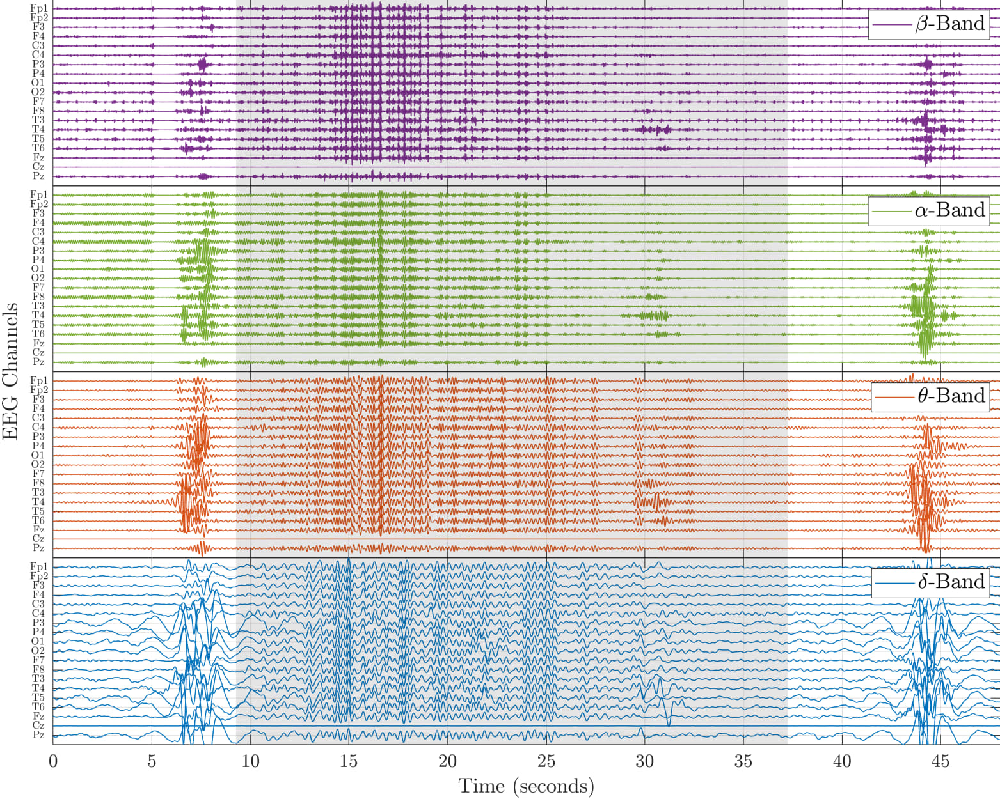
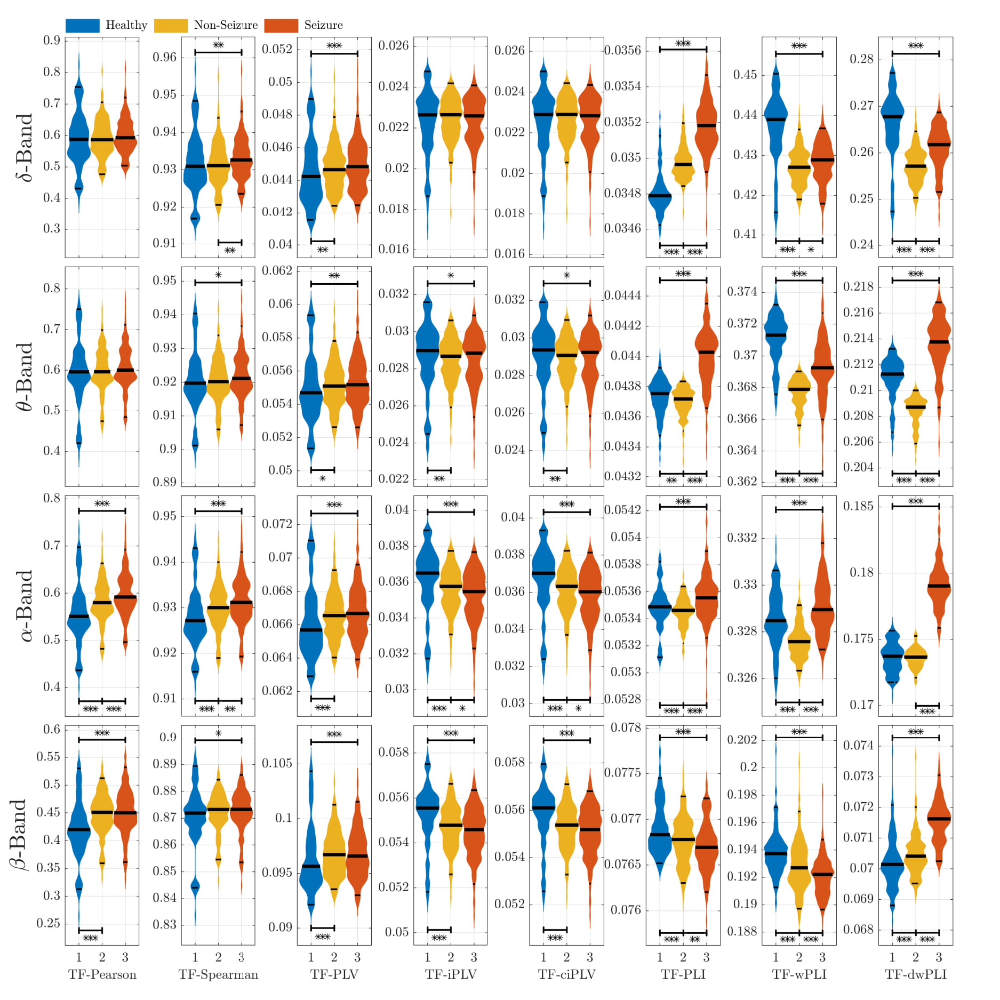

# TF-Connectivity: A Time-Frequency Functional Connectivity MATLAB Package 
A time-frequency (TF) signal processing framework for constructing functional brain networks (FBNs) from multichannel electroencephalogram (EEG) recordings. The material in this repository is provided to supplement the following publication:
Al-Sa'd, M. and Boashash, B., "Time-Frequency Functional Brain Networks: Application to Newborn Seizure Analysis", *IntechOpen*, (2025), https://doi.org/10.5772/intechopen.1011395.

The MATLAB scripts and functions in this repository are used to produce results, and supporting figures illustrated in the publication.

## Demo Scripts:
The developed TF-Connectivity MATLAB package contains the following demo scripts within its directory:
### Demo_1_eeg_plot.m
-   This demo script generates figure 1 that shows an example multi-channel newborn EEG signal at different frequency bands along with its seizure mask.
### Demo_2_statistical_comparison.m
-   This demo script generates figures 2 and 3 that illusrate the group comparisons using the traditional and proposed time-frequency FBN measures.

## Main Scripts:
The developed TF-Connectivity MATLAB package contains the following main scripts within its directory:
### main_1_preprocessing.m
-   This main script preprocesses the newborn EEG signals from the Helsinki EEG dataset via filtering, downsampling, frequency-band decomposition, and time segmentation. The preprocessed signals are saved in the "Processed EEG" folder.
-   The Helsinki EEG dataset must be downloaded and unzipped in the folder "The Helsinki EEG dataset". More information can be found in Nathan Stevenson, Karoliina Tapani, Leena Lauronen, & Sampsa Vanhatalo. (2018). A dataset of neonatal EEG recordings with seizures annotations [Data set]. Zenodo. https://doi.org/10.5281/zenodo.4940267
### main_2_conventional_bfns.m
-   This main script generates the conventional connectivity measures for each segment and each frequency band to build a tempo-spectral FBN for each subject in the dataset. The generated brain networks are saved in "Brain Networks\Conventional".
### main_3_time_frequency_bfns.m
-   This main script generates the proposed time-frequency connectivity measures to build a full tempo-spectral FBN for each subject in the dataset. The time-frequency brain networks are generated for each frequency band and averaged within each segment to allow associating connectivity with the segment-level seizure annotations. The time-frequency brain networks are saved in "Brain Networks\Time Frequency".

## Functions:
The developed TF-Connectivity MATLAB package is comprised of the following MATLAB functions that are in the Functions directory:
-   *file_logging.m*: It generates a log file with user-defined message.
-   *plot_multichannel.m*: It plots multichannel data. Examples of utility can be found also in Al-Sa'd, Mohammad F., and Boualem Boashash. "Design and implementation of a multi-sensor newborn EEG seizure and background model with inter-channel field characterization." *Digital Signal Processing* (2019). https://doi.org/10.1016/j.dsp.2019.02.003.
-   *violinPlot.m*: It is a modified code for generating violin plots for visualizing multiple distributions. The original code is developed by Jonas Dorn (jonas.dorn@gmail.com). Examples of utility can be found also in Al-Sa'd, M., Vanhatalo, S. and Tokariev, A., "Multiplex dynamic networks in the newborn brain disclose latent links with neurobehavioral phenotypes", *Human Brain Mapping*, (2024), https://doi.org/10.1002/hbm.26610.
-   *Xckd.m*: It generates the cross compact support kernel distribution of two input signals. Examples of utility can be found also in Boashash, B., Aïssa-El-Bey, A., & Al-Sa’d, M. F. (2018). Multisensor Time–Frequency Signal Processing MATLAB package: An analysis tool for multichannel non-stationary data. *SoftwareX*, 8, 53-58, https://doi.org/10.1016/j.softx.2017.12.002. and Boashash, B., & Aïssa-El-Bey, A. (2018). Robust multisensor time–frequency signal processing: A tutorial review with illustrations of performance enhancement in selected application areas. *Digital Signal Processing*, 77, 153-186, https://doi.org/10.1016/j.dsp.2017.11.017.
-   *corr_net.m*: It computes the conventional Pearson's and Spearman's correlations between two signals to estimate amplitude-based connectivity.
-   *plv_net.m*: It computes the following conventional single-trial phase-synchronization measures between two signals: phase locking value (PLV), imaginary PLV (iPLV), and corrected imaginary PLV (ciPLV).
-   *pli_net.m*: It computes the following conventional single-trial phase-synchronization measures between two signals: phase lag index (PLI), weighted PLI (wPLI), and debiased weighted PLI (dwPLI).
-   *tf_corr_net.m*: It computes the proposed time-frequency Pearson's and Spearman's correlations between two time-frequency representations to estimate time-frequency energy-based connectivity.
-   *tf_plv_net.m*: It computes the following proposed time-frequency phase-synchronization measures between two time-frequency representations: time-frequency phase locking value (TF-PLV), time-frequency imaginary PLV (TF-iPLV), and time-frequency corrected imaginary PLV (TF-ciPLV).
-   *tf_pli_net.m*: It computes the following proposed time-frequency phase-synchronization measures between two time-frequency representations: time-frequency phase lag index (TF-PLI), time-frequency weighted PLI (TF-wPLI), and time-frequency debiased weighted PLI (TF-dwPLI).

